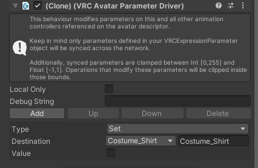

# Avatar Parameters Driver

VRC Parameter Driverを便利に使うコンポーネント

↓

## インストール

### VCCによる方法

1. https://vpm.narazaka.net/ から「Add to VCC」ボタンを押してリポジトリをVCCにインストールします。
2. VCCでSettings→Packages→Installed Repositoriesの一覧中で「Narazaka VPM Listing」にチェックが付いていることを確認します。
3. アバタープロジェクトの「Manage Project」から「Avatar Parameters Driver」をインストールします。

## 使い方

アバター内のGameObjectに「Add Component」ボタンなどから「Avatar Parameters Driver」コンポーネントを付けて設定します。

## 更新履歴

- 1.0.3
  - Animatorなどにあるパラメーターを含める
- 1.0.0
  - リリース

## License

[Zlib License](LICENSE.txt)
