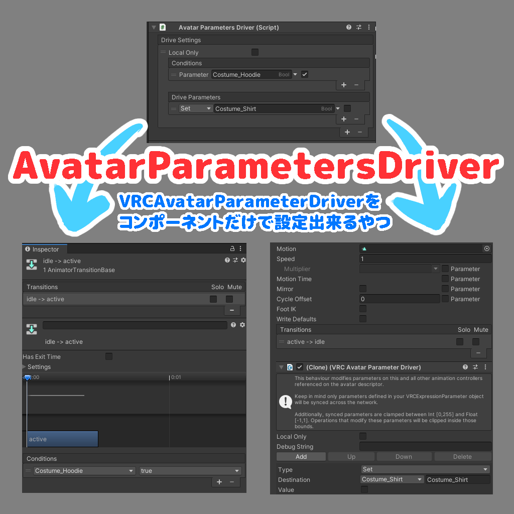

# Avatar Parameters Driver

VRC Parameter Driverを便利に使うコンポーネント

コンポーネントに設定するだけでアニメーションの条件遷移とVRC Avatar Parameter Driverが生成されます。

アバター衣装の依存関係制御などにご活用下さい。

手動アニメーション編集やAvatarMenuCreatorなどでは面倒だった、水着と服同時に出さないみたいなパラメーターの依存関係が簡単に設定出来たりします。

NDMF・Modular Avatarを利用しています。

## インストール

### VCCによる方法

1. https://vpm.narazaka.net/ から「Add to VCC」ボタンを押してリポジトリをVCCにインストールします。
2. VCCでSettings→Packages→Installed Repositoriesの一覧中で「Narazaka VPM Listing」にチェックが付いていることを確認します。
3. アバタープロジェクトの「Manage Project」から「Avatar Parameters Driver」をインストールします。

## 使い方

アバター内のGameObjectに「Add Component」ボタンなどから「Avatar Parameters Driver」コンポーネントを付けて設定します。

## 更新履歴

- 2.0.0
  - 外部連携APIの変更
    - Avatar Menu Creator for MA は 1.9.2 以降にアップグレードして下さい (1.9.1以前だとパラメーターが正しく取れません)
    - Avatar Parameters Exclusive Group は 0.2.0 以降にアップグレードして下さい  (0.1.2以前だとパラメーターが正しく取れません)
- 1.2.3
  - Animator内にTriggerがあるとエラーになる問題を修正
- 1.2.2
  - Avatar Optimizerの警告を削減
- 1.2.1
  - 複数条件を指定した場合2回目の遷移が正しくならない問題を修正
- 1.2.0
  - 外部連携ができるようにAPIを整理
- 1.1.0
  - パラメーターを外部申告できるように
- 1.0.5
  - パラメーターキャッシュ更新タイミングを修正
- 1.0.3
  - Animatorなどにあるパラメーターを含める
- 1.0.0
  - リリース

## License

[Zlib License](LICENSE.txt)
